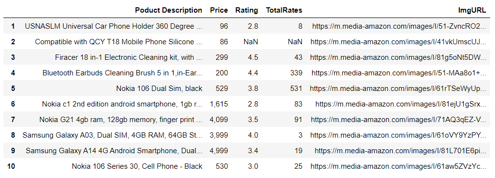

# Amazon Product Scraping using Selenium
Gathering products information from Amazon website using Python web scraping library like Selenium. Web scraping amazon products based on user search using Selenium Webdriver.

## Objectives
The objective of this project is to create a web scraper in Python using the Selenium library to gather information about products from the Amazon website. The scraper will take a user-defined search term as input and extract data such as product descriptions, prices, image URLs, ratings, and the total number of ratings. The scraped data will then be organized and saved into a single CSV file.  

## Output File Format
The scraped data will be stored in a CSV file with the following format: 

 

